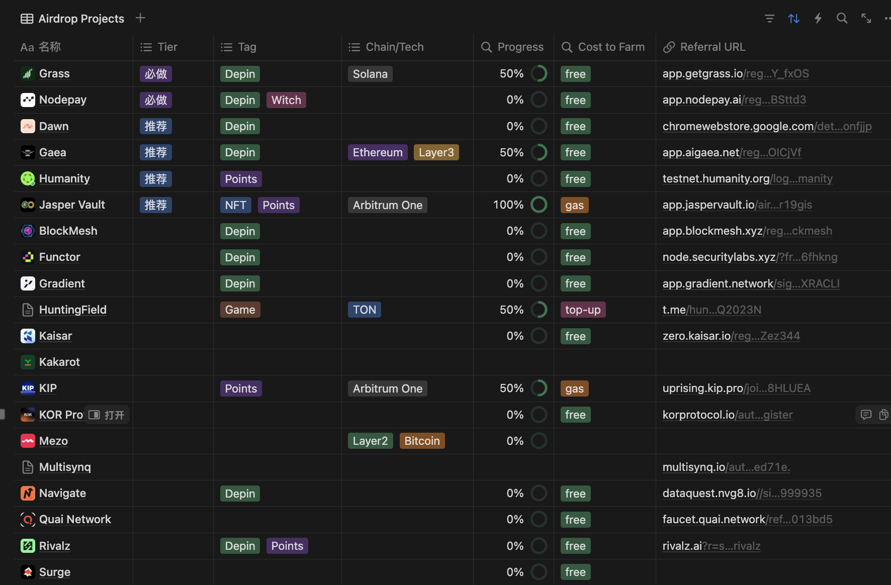

<!--
 * @Author: sanford courageux_san@wechat.com
 * @Date: 2024-11-09 15:03:27
 * @LastEditors: sanford courageux_san@wechat.com
 * @LastEditTime: 2024-11-13 22:57:24
 * @FilePath: /web3_script/README.md
 * @Description: 
-->
# Airdrop Tracker(空投任务集合)
Grass带火热的Depin类项目脚本的集合

**更多空投项目👀**:[Notion地址](https://zhousanfu.notion.site/135c1d6e542680d2b0adf24abbf8a519?v=e9f1da59cf9d40d4b1b00608ee9a340d&pvs=4)




# Script content(脚本集合内容):

1. **grass**     [注册地址](https://app.getgrass.io/register/?referralCode=ubpgK7NNkY_fxOS) | 使用方法[查看文档](./Doc/README_GRASS.md#python12x版本)
2. **gaea**    [注册地址](https://app.aigaea.net/register?ref=gaQuG9UcOICjVf) | 使用方法[查看文档](./Doc/README_GAEA.md)
3. **dawn**  [注册地址](https://chromewebstore.google.com/detail/dawn-validator-chrome-ext/fpdkjdnhkakefebpekbdhillbhonfjjp) | 使用方法[查看文档](./Doc/README_DAWN.md)
4. **nodepay** [注册地址](https://app.nodepay.ai/register?ref=qaUuuhtbNBSttd3) | 使用方法[查看文档](./Doc/README_NODEPAY.md)
6. **teneo** [注册地址](https://teneo.pro/community-node) | 使用方法[查看文档](./Doc/README_TENEO.md)

# config (你需要的配置)
复制.env.example 重新命名为.env

填入各个项目的参数
```
CRASS_USERID = ''

GAEA_UID = ''
GAEA_TOKEN = ''

NODEPAY_TOKEN = ''

DAWN_USER = ''
DAWN_PASS = ''
```

代理保存在: Proxies/proxies.txt

# 源:
- dawn https://github.com/GzGod/Dawn_ProMax
- grass https://github.com/ziqing888/getgrass-bot
- aigaea https://github.com/rilspratama/aigaea
- teneo  https://github.com/GzGod/Teneo
- Network3 https://github.com/GzGod/Network3
- nodepay https://github.com/Zlkcyber/nodepay 


# Support Me (打赏支持)
if you want to support me, you can donate to my address:
如果您喜欢这个项目并希望支持我，可以通过以下方式进行打赏：

SOL
```
6kBdPBHLkm4bUVXF952fYUXzGLtFqqY34ZkqcikF2sno
```
TON
```
UQAE-FI5VOcm1mfPALRPTW7wrTzpgk94mDd_rL2VJmUT40cq
```
| Wechat | Alipay | USDT |
|------|--------|------|
|  |  |  |
# web3_script